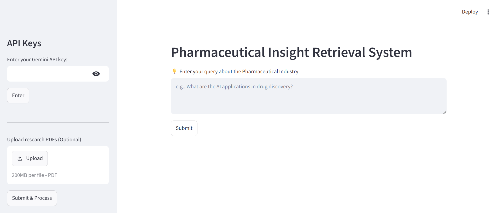
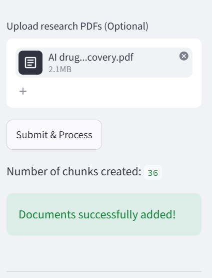
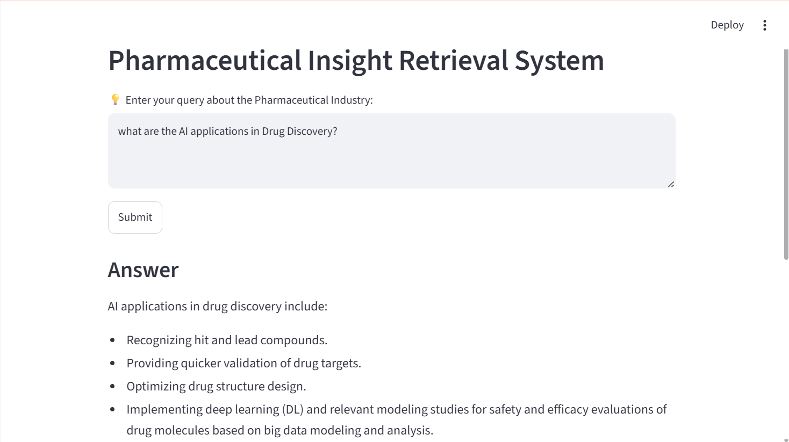

# PharmaQuery 🧪

### AI-Powered Pharmaceutical Research Assistant

PharmaQuery is a Retrieval-Augmented Generation (RAG) application that enables users to upload pharmaceutical research papers and interact with them using natural language. The system retrieves relevant information from the uploaded documents and generates accurate responses grounded in the document content.

---

## ✨ Features

* 📄 Upload pharmaceutical research PDFs
* 🔍 Semantic search using vector embeddings
* 🧠 Gemini 2.5 Flash for answer generation
* 🗂 ChromaDB vector database
* 📚 Retrieval-Augmented Generation (RAG)
* 📑 Source document references with page numbers
* ⚡ Streamlit-based interactive UI
* 🎯 MMR retrieval for improved relevance

---

## 🏗 Architecture

```text
                PDF Documents
                       │
                       ▼
              PyPDF Document Loader
                       │
                       ▼
         RecursiveCharacterTextSplitter
                       │
                       ▼
              Gemini Embedding Model
                       │
                       ▼
                 Chroma Vector DB
                       │
                       ▼
                 MMR Retriever
                       │
                       ▼
               Gemini 2.5 Flash LLM
                       │
                       ▼
                  Generated Answer
```

---

## 🛠 Tech Stack

| Component      | Technology                     |
| -------------- | ------------------------------ |
| Language       | Python                         |
| Frontend       | Streamlit                      |
| Framework      | LangChain                      |
| Embeddings     | Gemini Embedding 2             |
| Vector Store   | ChromaDB                       |
| LLM            | Gemini 2.5 Flash               |
| PDF Processing | PyPDF                          |
| Chunking       | RecursiveCharacterTextSplitter |

---

## 📷 Screenshots

### Home Page



---

### Uploading Research Documents



---

### Generated Answer



---

## 🚀 Getting Started

### Clone the Repository

```bash
git clone https://github.com/<your-username>/pharmaquery-rag.git
cd pharmaquery-rag
```

### Install Dependencies

```bash
pip install -r requirements.txt
```

### Run the Application

```bash
streamlit run app.py
```

---

## 💡 Example Questions

* What are the AI applications in drug discovery?
* How does AI help in target identification?
* What are the challenges of AI in pharmaceuticals?
* How is AI used for toxicity prediction?
* Explain the role of AI in clinical trials.

---

## 📂 Project Structure

```text
pharmaquery-rag
│
├── app.py
├── requirements.txt
├── README.md
├── .gitignore
│
├── screenshots
│   ├── home_page.png
│   ├── upload_pdf.png
│   └── answer_output.png
│
├── temp
├── pharma_db
└── __pycache__
```

---

## 🔮 Future Improvements

* Multi-PDF support
* Conversational memory
* Chat history
* Citation highlighting
* Streamlit Cloud deployment
* Hybrid search (BM25 + Vector Search)
* Metadata filtering

---

## ❤️ Created by Reddiah

Built with Streamlit, LangChain, Gemini, and ChromaDB.
